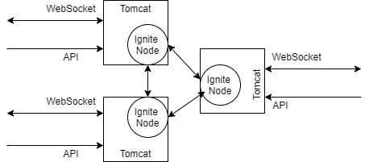

# ESTUARY-WEB - Data streems pushed to web browser

## Table of Contents 
* [Description] (#description)
* [Architecture and Component Design] (#design)
* [Technologies and APIs] (#technologies-apis)
* [Deployment and Usage] (#deployment-usage

## Description

This project provides WebSocket Server end point based on JEE spec. estuary-web.war is a single deployable file into tomcat. Apache Ignite 2.8 is used for message distribuiton across muliple instances of tomcat servers.  

Technologies 

## Architecture and Component Design

## Message Formats

@[Alt text](src/doc/messgeformats.txt "Message Formats")

